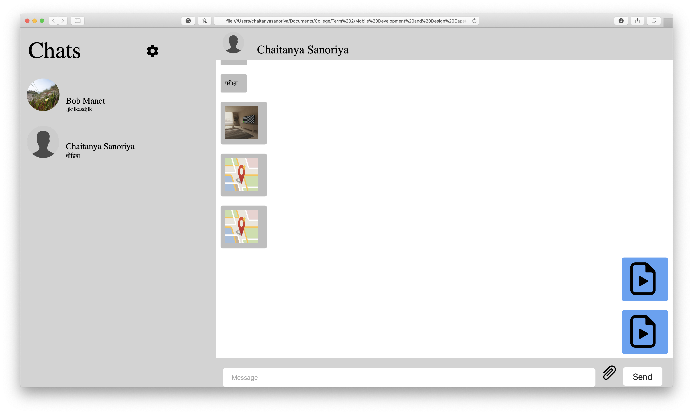

# LingoChat - Website
Android Version: [link](https://github.com/Lambz/Capstone_WeThree_LingoChat_Android)
 
iOS Version: [link](https://github.com/Lambz/Capstone_WeThree_LingoChat_iOS)
 
Deployed Website: [link](https://lambz.github.io/Capstone_WeThree_LingoChat-Web/)

## Screenshots

  

  

  

  

  

  

  

